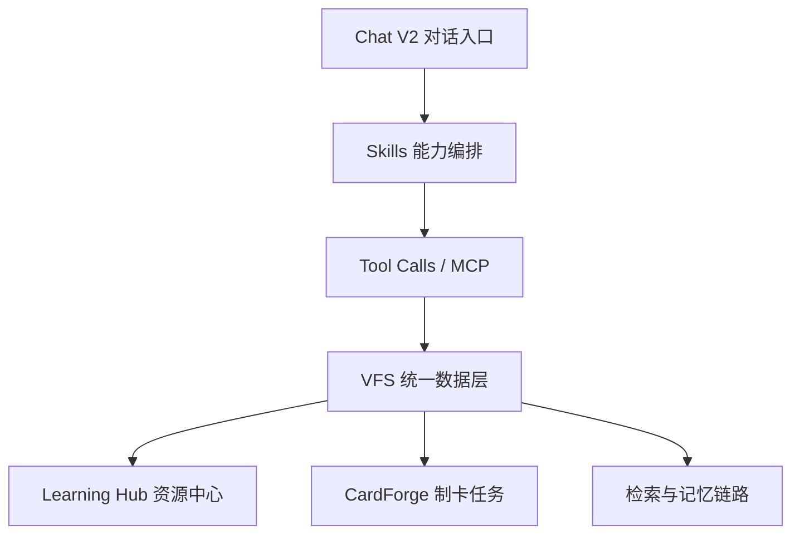

# DeepStudent 功能架构（代码对齐版）

> 目标：用稳定、可验证的结构描述系统，减少依赖“固定数量”带来的文档漂移。

## 架构总览

该结构体现三件事：
- **入口统一**：以 Chat V2 为主要任务入口
- **能力按需**：通过 Skills 决定调用哪些工具
- **数据统一**：资源沉淀在 VFS，再被各子系统复用

## 1) 智能对话 (Chat V2，入口层)

职责：承载用户任务、会话状态和执行反馈。

可见能力：
- 多会话管理与流式消息渲染
- 上下文引用与来源回显
- 工具调用过程与任务状态展示
- 与 学习资源中心 / CardForge 的双向跳转

## 2) 技能系统 (Skills，编排层)

职责：把任务意图映射成“可执行能力集”。

可见能力：
- 指令型技能（改变助手行为）
- 工具组技能（注入可调用工具）
- 内置、全局、项目三级加载
- 自定义技能创建与覆盖

## 3) Tool Calls + MCP（执行层）

职责：连接内置工具与外部服务。

可见能力：
- 内置工具随技能按需注入
- MCP 外部服务接入与状态管理
- 支持 SSE / WebSocket / HTTP 传输
- 调用结果回流到对话与文档链路

## 4) 统一数据层 (VFS)

职责：作为学习资产的统一数据底座（SSOT）。

可见能力：
- 学习资源统一建模与存储
- OCR、分块、嵌入、向量化流水线
- 本地检索与跨模块复用
- 配合 SQLite / LanceDB / Blob 形成可审计资产体系

## 5) 应用层（学习资源中心 / CardForge / 系统配置）

职责：把数据能力和模型能力落成具体学习流程。

可见能力：
- 学习资源中心 (Learning Hub)：资源组织、拖拽注入、索引状态
- CardForge：任务看板、模板、导出与同步
- 系统配置：模型接入、搜索配置、备份同步、治理审计

## 6) 架构边界与校准原则

- 不再把历史已收敛/已合并的页面当成独立核心模块
- 以“入口层—编排层—执行层—数据层”做文档骨架
- 对外文案优先描述能力关系，减少硬编码数量
- 若要展示数量，请先以主项目当前实现复核后再更新
