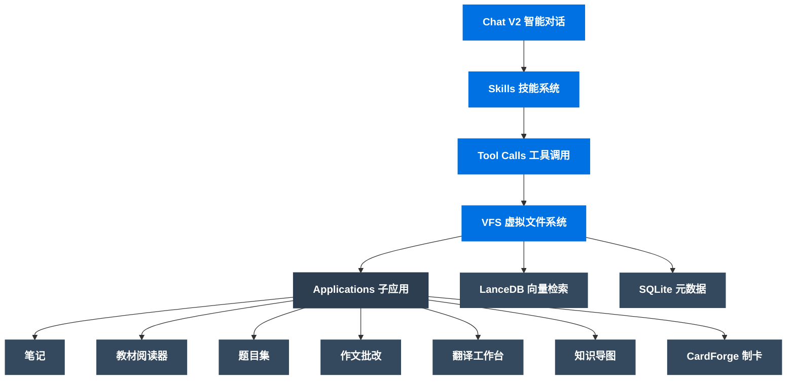

# DeepStudent 核心功能指南

---

## 架构概览

DeepStudent 采用「对话即入口」的架构设计：

---

## 功能模块 1：Chat V2 智能对话

### 核心入口

这是 DeepStudent 的主交互界面，所有功能通过对话驱动。

#### 核心特性
- **多会话管理**：按时间分组（今天 / 昨天 / 7天 / 30天 / 更早），支持会话搜索和回收站
- **流式响应**：实时显示 AI 回复，支持打断和重试
- **Block 交互架构**：消息由独立块组成（Markdown、代码、思维导图、图片、PDF、表格、LaTeX、Mermaid 等 14 种）
- **上下文引用**：通过 ContextSnapshot 引用 VFS 资源进行 RAG 检索
- **推理模式**：展示 AI 思考过程（思维链），支持深度思考
- **多模型对比**：同时使用多个 LLM 模型进行对比回复
- **附件上传**：图片、PDF、文档拖拽上传，多模态交互

---

## 功能模块 2：Skills 技能系统

### 渐进披露架构

工具不再全量预加载，通过 Skill 按需注入，显著减少上下文占用。

#### 内置指令技能（5 个）
| 技能 | 功能 |
|:---|:---|
| `tutor-mode` | 苏格拉底式教学，引导思考 |
| `chatanki` | 端到端制卡闭环 |
| `literature-review` | 文献综述 |
| `research-mode` | 深度调研 |
| `deep-scholar` | 深度学术研究 |

#### 工具组技能（13 组，共 65 个工具）
- `knowledge-retrieval`（知识检索，2 个工具）
- `learning-resource`（学习资源，4 个工具）
- `canvas-note`（笔记工具，7 个工具）
- `vfs-memory`（记忆系统，6 个工具）
- `mindmap-tools`（思维导图，6 个工具）
- `attachment-tools`（附件工具，2 个工具）
- `todo-tools`（待办工具，4 个工具）
- `qbank-tools`（题库工具，13 个工具）
- `workspace-tools`（工作区工具，9 个工具）
- `web-fetch`（网页抓取，1 个工具）
- `subagent-worker`（子代理工作器，2 个工具）
- `template-designer`（模板设计，8 个工具）
- `ask-user`（交互提问，1 个工具）

#### 三级加载
1. **内置 Skill** — 随应用预装
2. **全局 Skill** — `~/.deep-student/skills/` 用户全局共享
3. **项目 Skill** — `.skills/` 项目级别

#### 激活方式
- `/skill <id>` 命令激活
- UI 选择器手动选择
- LLM 自动推荐
- 默认技能自动加载

---

## 功能模块 3：VFS 学习资源中心

### Finder 风格文件管理

统一管理所有学习资源，支持 8 类资源类型：

| 资源类型 | 说明 |
|:---|:---|
| 笔记 | Markdown 编辑器、AI 辅助写作、双向链接 |
| 教材 | PDF / Word / Excel / PPT，内置阅读器 |
| 题目集 | OCR 识题、AI 解析、8 种练习模式 |
| 翻译 | 中英文翻译练习 |
| 作文 | 作文批改和评分 |
| 知识导图 | 思维导图形式的知识整理 |
| 图片 | 图片资源管理 |
| 文件 | 其他格式文档 |

#### 智能索引
- 导入时同步 OCR 识别
- 异步向量化索引（LanceDB）
- 全文检索 + 向量检索
- 索引状态实时追踪

---

## 功能模块 4：Anki 智能制卡（CardForge 2.0）

### Chat-First 制卡体验

#### 使用流程
1. 在对话中激活 `chatanki` 技能（输入 `/skill chatanki`）
2. 上传文档或发送文本内容
3. AI 自动分段并生成卡片
4. 在对话中预览卡片效果
5. 一键导出至 Anki 或保存为 APKG

#### 核心特性
- **智能分段**：SegmentEngine 将大文档分割为语义完整片段
- **并行制卡**：CardEngine 并行生成多张卡片
- **多模板系统**：10+ 内置模板，支持 HTML / CSS / Mustache 自定义
- **3D 预览**：可视化预览卡片效果
- **任务控制**：暂停 / 恢复 / 取消 / 重试
- **AnkiConnect 同步**：一键推送至 Anki 桌面端
- **APKG 导出**：导出 Anki 卡包文件

---

## 功能模块 5：智能题库

### OCR 识题 → AI 解析 → 科学练习

#### 使用流程
1. 上传试卷照片或文档
2. AI 自动 OCR 识别并拆分为单道题目
3. AI 自动生成解析、知识点标签、难度评级
4. 选择练习模式进行练习

#### 8 种练习模式
顺序练习、随机练习、错题优先、按标签、限时练习、模拟考试、每日一练、组卷练习

#### 其他特性
- SM-2 间隔重复算法
- 多维度统计（学习趋势、活跃度、薄弱知识点）
- CSV 导入导出
- 错题自动归档

---

## 功能模块 6：作文批改

### 流式多维评分

- **7+ 考试类型**：高考、雅思、考研、四六级等
- **多维度评分**：词汇、语法、结构、逻辑
- **流式批改**：AI 逐步输出评语和修改建议
- **多轮迭代**：对同一篇作文多次修改，记录进步轨迹
- **手写作文 OCR**：支持手写作文识别

---

## 功能模块 7：翻译工作台

### 11 种语言互译

支持中文、英语、日语、韩语、法语、德语、西班牙语、俄语、阿拉伯语、葡萄牙语、意大利语。

#### 核心特性
- **多模式输入**：文本输入、图片 OCR（截图/拍照）、文档上传
- **流式翻译**：实时显示翻译过程，支持打断
- **正式度调整**：正式 / 休闲 / 自动风格切换
- **TTS 朗读**：高质量语音朗读，辅助听力练习
- **历史记录**：所有翻译记录自动保存到 VFS

---

## 功能模块 8：知识导图

### 多种布局与双视图

#### 核心特性
- **双视图**：思维导图（Canvas）和大纲（Outline）无缝切换
- **多种布局**：思维导图、逻辑图、组织结构图
- **键盘优先**：全键盘操作，无需鼠标
- **背诵模式**：遮盖节点自测复习
- **格式兼容**：导入导出 OPML / Markdown / JSON
- **样式定制**：多种精美主题，节点样式微调

---

## 功能模块 9：深度阅读

### PDF / Word 智能阅读

- **分屏阅读**：文档与对话并排显示
- **AI 精读**：逐页内容深度解析
- **选页追问**：选择页面范围精准提问
- **双引擎 OCR**：DeepSeek OCR / PaddleOCR 精准识别
- **Word 解析**：试卷 / 文档结构化分析

---

## 功能模块 10：系统配置

### 灵活的模型与工具配置

#### API 配置
- 支持 13+ 家 LLM 供应商
- SiliconFlow 一键配置（推荐新手）
- 模型分配覆盖 13 个功能点（对话、制卡、嵌入、重排、总结等）

#### MCP 工具
- 支持 MCP 协议外部工具
- 预构建服务器列表
- 手动配置自定义 MCP 服务器

#### 外部搜索
- 7 种搜索引擎：Google CSE、SerpAPI、Tavily、Brave、SearXNG、智谱 AI、博查 AI
- 高级搜索参数、站点过滤

#### 数据管理
- 分层备份策略（P0 核心 ~ P3 大资产）
- 云同步（WebDAV / S3）
- 健康检查与审计日志

---

## 使用建议

### 新手入门顺序
1. 完成 [API 配置](./start.md)（推荐 SiliconFlow 一键配置）
2. 从智能对话开始体验
3. 尝试 `/skill tutor-mode` 进入导师模式
4. 导入学习资料到 VFS
5. 使用 `/skill chatanki` 进行智能制卡

### 最佳实践
- 定期使用数据管理进行备份
- 建立学科分类的学习资源
- 善用 Skills 系统按需加载工具
- 关注版本更新获取新功能
