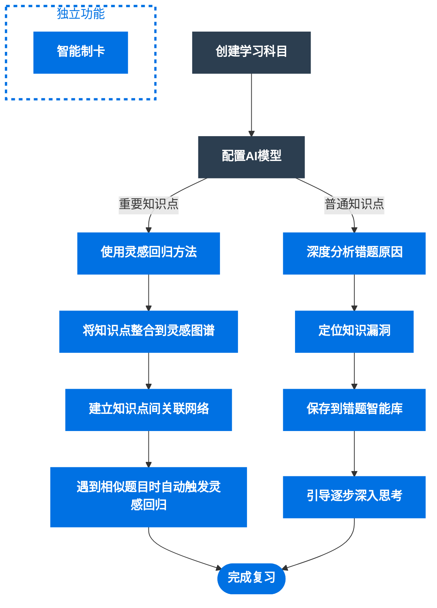

# DeepStudent 核心功能指南
---

## 典型使用流程

## 功能模块 1：分析

### 主界面功能
这是软件的核心交互区域，用于题目分析和解答。

#### 使用流程
1. **选择科目**：在界面标题栏选择对应的学科
2. **输入题目**：
   - 在输入框中输入题目的文本描述
   - 通过点击上传按钮添加题目截图（支持多图）
3. **开始分析**：点击"开始分析"按钮
4. **查看结果**：AI 的分析过程和答案会流式显示在对话窗口中

#### 持续对话
- 首次分析完成后，可在下方输入框继续进行追问
- 支持多轮对话，深入探讨题目
- 可将整个对话和分析结果保存到"错题库"

#### 学习总结
对话结束后，点击"生成学习总结"以便于未来回顾分析。

## 功能模块 2：知识库

### 基于 RAG 的个性化知识库
构建自己的专业知识库，让 AI 回答更贴近你的学习资料。

#### 创建分库
1. 进入"知识库"模块
2. 创建不同的知识"分库"，例如：
   - "有机化学"
   - "电磁学专题"
   - "高等数学"

#### 上传文档
1. 选择目标分库
2. 上传学习资料（支持 `PDF、TXT、MD` 等格式）
   - ⚠️ 仅支持包含可编辑文字的 PDF
   - 图片型 PDF 无法解析
3. 后台自动处理：
   - 文档切割
   - 向量化处理
   - 处理时间可能较长

#### 使用知识库
1. 在"通用分析"界面
2. 启用"知识库 (RAG)"开关
3. AI 会先从指定分库检索相关知识
4. 结合知识库内容进行精准分析

## 功能模块 3：Anki 制卡

### 深度集成的制卡工具
从文档自动生成 Anki 卡片，支持多种模板。

#### 一键生成卡片
1. 进入"Anki 制卡"模块
2. 上传文档（课堂笔记、教材等）
   - ⚠️ 仅支持包含可编辑文字的 PDF
   - 图片型 PDF 无法解析
3. AI 自动阅读并生成问答式 Anki 卡片

#### 卡片模板
- **内置模板**：
  - 极简卡片
  - 编程卡片
  - 选择题卡片
  - 法律条文卡片
  - 语言学习卡片
  - 填空题卡片
- **自定义模板**：
  - 支持 HTML 和 CSS
  - 可以编辑模板中的样式和字段，适应个人需要
  - 自动根据模板构造完整提示词

#### 导入 Anki

- **导出 .apkg**：
  - 导出为 `.apkg`文件
  - 可在其他设备导入 Anki

#### 模型选择
- **推荐模型（尽量选择非推理模型）**
- `deepseek-v3`
- `Qwen/Qwen3-30B-A3B-Instruct-2507`
- `gemini-2-5-flash`
- `gemini-2-5-flash-lite`
## 功能模块 4：统一回顾

### 错题回顾系统
定期回顾和巩固已保存的错题。

#### 使用流程
1. 从"错题本"中选择多道错题（最好是已经生成过总结的错题）
2. 发起"综合回顾"
3. AI 据此生成个性化复习方案

## 功能模块 5：数据管理

### 数据导入导出
在"设置" → "数据导入导出"中管理数据。

#### 导出数据
- 完整备份所有数据
- 包含设置和知识库索引
- 生成可导入的备份文件

#### 导入数据
- 在新设备上恢复数据
- 重装系统后恢复配置
- 支持跨设备数据迁移

## 功能模块 6：系统设置

### 个性化配置
软件的核心配置区域。

#### 科目管理
- 自定义每个科目的分析要求
- 设置科目专属的 Prompt
- 调整分析参数

#### 外观主题
- 切换浅色/深色模式
- ⚠️ 当前暂不可用

#### 功能开关
- 启用/禁用实验性功能
- 根据需求定制功能
- 控制新特性使用

## 使用建议

### 新手入门顺序
1. 完成 [API 配置](./start.md)
2. 从"分析"模块开始使用
3. 逐步探索其他功能
4. 建立个人知识库
5. 使用 Anki 制卡功能

### 最佳实践
- 定期备份数据
- 建立学科分类的知识库
- 使用推荐模型配置
- 关注 BUG 修复更新
