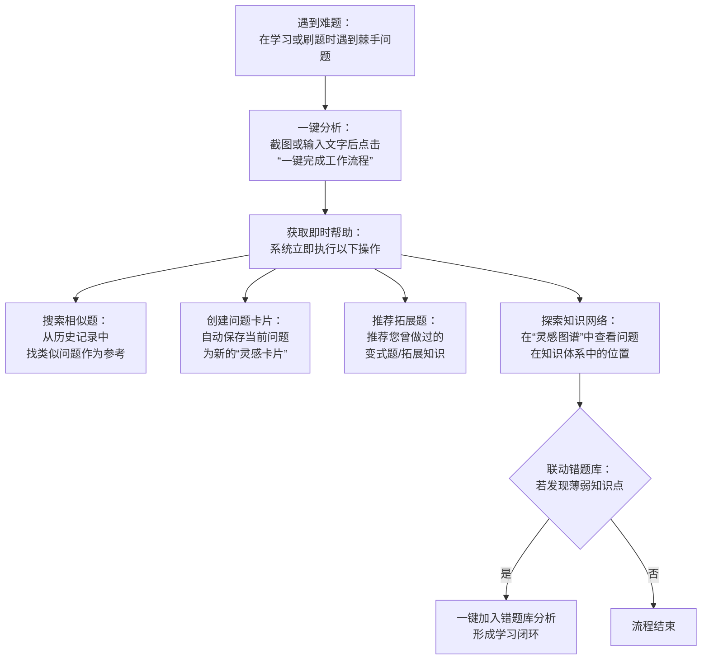

# IREC介绍
---

### 典型使用流程

1.  **遇到难题**：在学习或刷题时遇到一个棘手的问题。
2.  **一键分析**：将问题截图或输入文字，点击“一键完成工作流程”。
3.  **获取即时帮助**：系统会立即为您：
    *   **搜索相似题**：从您的历史记录中找到类似的问题作为参考。
    *   **创建问题卡片**：自动将当前问题保存为一张新的“灵感卡片”。
    *   **推荐拓展题**：AI会推荐相关的您曾经做过的变式题或拓展知识，助您贯通记忆中知识点之间的联系。
4.  **探索知识网络**：您可以随时在“灵感图谱”中查看任意问题，直观地理解其在知识体系中的位置和关联。
5.  **联动错题库**：如果某个知识点是您的薄弱项，可以一键将其加入“错题库”进行分析，形成学习闭环。

### 第一章：灵感回归——超越记忆，复现智慧

#### 写给Anki用户的终极解释：什么是灵感回归？

如果您是Anki的深度用户，一定对它在记忆陈述性知识（比如背单词、记年份）方面的强大效果印象深刻。通过精准的间隔重复，Anki帮助我们对抗遗忘，堪称记忆神器。

但学习的疆域远不止于此。您是否也曾有过这样的困惑：

-   **痛点一：精于记住了是什么，却忘了如何与为何**

    当面对需要融会贯通的程序性知识或体系化知识（如数学解题、编程设计、案例分析）时，Anki似乎就显得力不从心了。一个复杂的解题技巧或思维框架，很难被简单地压缩成一张卡片。即便做成了卡片，复习时看到的也只是脱离了应用场景的、冰冷的步骤。这背后是编码特异性原则(Encoding Specificity Principle)在起作用：我们在一个丰富的情境（比如解一道难题）中编码了知识，但Anki却在一个孤立的环境中让我们回忆，这种情境的缺位导致了记忆的低效。对于数学解题这类体系化的学习，最致命的遗忘，往往不是忘记了某个公式（陈述性知识），而是**忘记了当初那个灵光一闪的解题思路是如何与具体问题联系起来的**。我们失去了最重要的东西：解题的思路、试错的过程，以及知识点之间联动的鲜活体验。

-   **痛点二：感觉是我为工具服务，而不是工具为我服务**

    高昂的维护成本是另一大痛点。我们需要花费大量精力手动创建和整理卡片，而每天雷打不动的复习任务，常常与我们当前的学习重点脱节，导致一种为工具打工的倦怠感。

灵感回归（MathWorkflow）正是为了解决这些Anki的盲区而生。

它的核心目标不是替代Anki，而是成为一个智慧的灵感学伴，专注于复现您解决问题的完整**思路、经验和灵感**。它复习的是**方法论**，而不仅仅是孤立的**知识点**。

#### 灵感回归如何工作：让工具真正为您服务

灵感回归的核心理念是**工具服务于人**，它致力于将复习这个动作，无缝地融入您解决问题的自然流程之中。

1.  **聚焦当下的智能分析**：当您遇到一个新问题时，只需通过图片或文字将其输入系统，然后点击一键完成工作流程。灵感回归引擎会立即启动，像一个智能助理一样，为您执行三件核心工作：
    *   **立即搜索相似问题**：快速在您的知识库中寻找过往的相似案例，为当前解题提供即时参考。
    *   **自动创建当前问题卡片**：将您输入的问题自动结构化，生成一张包含初步洞察的新灵感卡片。这个洞察是AI生成的起点，您可以随时在灵感图谱中对其进行修改和完善，使其真正符合您自己的理解。
    *   **深度推荐关联知识**：利用AI分析新问题的核心，为您推荐高度相关的变式题或拓展知识，帮助您举一反三。

2.  **情境触发的回顾**：它没有固定的复习时间表。它的回顾，是由您**当前**遇到的问题来智能触发的。当您面对一个新问题时，引擎会立即分析它，并主动地提醒您：

    > 嘿，你现在遇到的问题B，和你上个月解决问题A时那个绝妙的想法很像。当时你是这么思考的，要不要回顾一下？

    您不再需要执行打卡式的复习，而是在最需要的时候，获得最相关的过往经验，让每一次回顾都成为一次生产力的真实提升。

#### 灵感图谱：为灵感回归服务的可视化界面

那么，这些被回归的灵感和思路，将以何种形式呈现给您呢？答案就是**灵感图谱（IrecGraphFlow）**。

灵感图谱是灵感回归引擎的可视化前端。当灵感回归为您找回相关的过往经验（相似题、变式题）后，它会以一个清晰的列表呈现这些结果。而灵感图谱则是您探索这些知识背后宏大网络的画布。您可以随时将任意一个问题定位到图谱中，去直观地看到：

-   解决当前问题需要哪些关键步骤。
-   这些步骤之间存在怎样的逻辑联系。
-   每一个步骤又关联着哪些更基础的知识点。
-   **修改和完善您的洞察**：图谱不仅是看的，更是可以交互的。您可以直接在图谱上编辑和深化每张卡片中的洞察，使其成为您自己思想的沉淀。

简而言之，**灵感回归是核心引擎**，负责在最恰当的时机，从您过往的经验中提取出最有价值的智慧；而**灵感图谱则是呈现这些智慧的画布**，让您能够一目了然地看清思维的脉络。

### 第二章：智能联动——灵感图谱与错题库的双向驱动

为了将灵感回归的智慧真正落地，系统还提供了强大的错题库模块，并与灵感图谱形成了高效的双向联动，构建了完整的学习闭环。

#### 核心联动流程

1.  **从灵感图谱发现薄弱点，一键启动错题分析**

    当您在灵感图谱上探索，发现某张灵感卡片是您尚未完全掌握的薄弱环节时，卡片上会提供一个**分析错误**的选项，让您能立刻针对性地进行深入分析和练习。

2.  **从灵感图谱直达错题详情，深入理解解决方案**

    一旦错题分析完成，对应的灵感卡片状态便会更新。此时，分析错误按钮会自动变为**查看错误**，点击即可跳转到错题库中该题目的详细页面，回顾完整的解题步骤和AI解析。

3.  **从错题库回溯灵感图谱，构建知识网络**

    反之，当您在错题库中学习某道错题时，也可以随时导航回它在灵感图谱中的位置，从而将它放回整个知识网络的背景中去理解，真正做到举一反三。

通过这套机制，灵感回归不仅帮您复现了智慧，更通过与错题库的联动，确保了您可以将这些智慧转化为牢固掌握的能力。