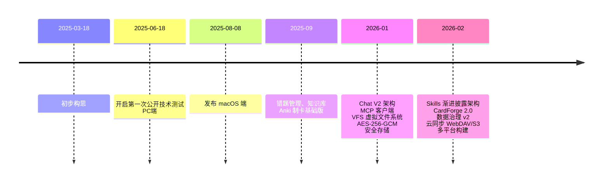

# 项目历程

## 里程碑详情

### 2025-03-18：项目构思
- 确立「AI 原生学习系统」的产品方向
- 选择 Tauri 2.0 作为跨平台桌面框架

### 2025-06-18：首次公开技术测试
- PC 端（Windows）首发
- 错题分析、知识库、基础 Anki 制卡

### 2025-08-08：macOS 端发布
- Apple Silicon 原生支持
- 界面体验优化

### 2026-01：核心架构升级
- **Chat V2**：Block 交互架构、插件化设计
- **MCP 客户端**：支持 MCP 协议扩展工具生态
- **VFS 虚拟文件系统**：8 类资源统一管理，自动向量化索引
- **安全存储**：AES-256-GCM 加密敏感数据

### 2026-02：功能完善与文档建设
- **Skills 渐进披露架构**：5 个指令技能 + 13 组工具组（65 个工具）
- **CardForge 2.0**：ChatAnki 对话式制卡、智能分段、多模板
- **数据治理 v2**：分层备份（P0–P3）、Schema 注册表、审计日志
- **云同步**：WebDAV / S3 增量同步
- **多平台构建**：macOS、Windows、iOS、Android
- **用户文档体系**：完整的用户指南与文档站
