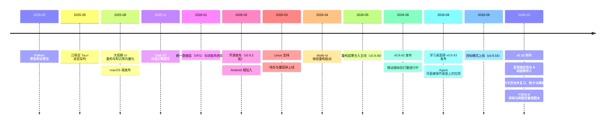

# 项目历程

DeepStudent 从 2025 年春天的一个 Python 小实验，成长为今天覆盖桌面与移动端的开源学习
工作台。这一路不是匀速前进的：项目经历了几次伤筋动骨的"大重构"，每一次都源于同一个追问
——怎样让 AI 直接替你完成学习中的整理、出题、制卡与复习安排。

下面这张图是全程总览，正文按每次重构展开。

## 缘起：一个 Python 小实验（2025 年 3 月）

DeepStudent 的起点很朴素：一个 Python demo，用来验证"AI 辅助学习"这个想法是否成立
——让模型围绕你的学习材料回答问题、整理知识，而不是泛泛聊天。

原型很快证明了方向可行，但也暴露了 Python 脚本的天花板：没有像样的界面，数据管理原始，
更谈不上跨平台分发。要把它做成普通学生能日常使用的软件，需要彻底换一套地基。

## 第一次重构：迁移到 Tauri 桌面架构（2025 年 5 月）

2025 年 5 月，项目整体迁移到 Tauri + React + Rust 技术栈。这次重写换来了三件事：

- **真正的桌面应用**：原生窗口、本地文件访问，而不是命令行脚本；
- **本地优先的数据底座**：学习数据存在你自己的电脑上，为后来的隐私承诺打下基础；
- **跨平台的可能性**：同一套代码，日后得以延伸到 Windows、macOS、Linux 乃至手机。

迁移完成后，项目在 2025 年 6 月进行了首次公开技术测试（PC 端），8 月发布了 macOS 端。

## 第二次重构：界面与知识库的全面升级（2025 年 8 月 - 10 月）

用户多了，问题也来了：早期界面是"能用"级别的，而知识库只能存文件、不能理解文件。
2025 年 8 月起，项目做了第一次大规模 UI 重构，并补上了关键的一环——知识库向量化。

- 界面迁移到 shadcn-ui 组件体系，引入了统一的对话（Chat）架构；
- 导入的资料开始被切分、索引，AI 能"读过"你的教材再回答问题；
- 9 月集成 Milkdown 笔记编辑器与 Anki 模板管理，10 月完成国际化（中英双语）、
  引入 Playwright 自动化测试，并将向量存储迁移到 Lance。

对用户来说，这个阶段的变化是：DeepStudent 从"一个能聊天的窗口"变成了
"围绕你的资料工作的学习软件"。

## 第三次重构：Chat V2 对话引擎重写（2025 年 11 月 - 2026 年 1 月）

随着功能增多，第一代对话架构越来越吃力：工具调用、多模型、流式输出各自为政，
每加一个能力都像在旧房子上加盖。2025 年 11 月，团队决定重写对话引擎，即 Chat V2。

这次重写在 2026 年 1 月底随 v0.9.0 版本成型，带来了：

- **稳定的多轮对话**：消息编辑、流式响应、会话状态管理全部重新设计；
- **工具事件系统**：AI 调用搜索、制卡、出题等工具的过程对用户透明可见；
- **多模型支持**：同一问题可以交给不同模型对比回答；
- 同期还完成了性能优化（会话加载并行化）和 DSTU 资源协议，为下一步铺路。

今天你在 DeepStudent 里体验到的对话能力——深度推理、会话分支、多 Tab、子代理——
都建立在这次重写的地基上。

## 第四次重构：统一数据层与技能系统（2026 年 1 月 - 2 月）

这是最能定义 DeepStudent 的一次重构。此前笔记、教材、题目、导图各有各的存储方式，
模块之间数据不通。2026 年 1 月，项目引入了 **VFS 统一虚拟文件系统**：所有学习资源
进入同一个数据层，配合 SQLite 元数据与 LanceDB 向量索引，一份材料可以同时被阅读、
提问、生成导图、出题、制卡——不需要在模块之间导来导去。

紧接着，v0.9.1（2026 年 2 月 12 日）落地了 **Skills 渐进披露架构**：AI 的能力被拆成
一个个"技能"，激活时才加载对应工具，既省 Token 又让扩展变得容易。同期还有：

- ChatAnki 端到端制卡闭环，取代了原来独立的 CardForge 制卡流程；
- 数据治理面板：备份、同步、审计、迁移集中管理；
- 云同步（WebDAV / S3 兼容存储）首次亮相。

"统一数据层 + 技能系统"由此成为后来学习 Agent 的地基：Agent 能直接读写各个应用，依靠的正是
同一套数据层和按需加载的技能。

## 开源发布与多平台扩展（2026 年 2 月 - 3 月）

2026 年 2 月 13 日，项目更名为 DeepStudent 并正式开源（AGPL-3.0），首个开源版本为
v0.9.2。开源后的六周是项目迭代最快的时期，从 v0.9.5 一路发布到 v0.9.35：

- **平台扩张**：v0.9.8（2 月 17 日）加入 Android 构建，v0.9.30（3 月 3 日）支持
  Linux（deb / AppImage），实现 Windows / macOS / Linux / Android 四平台覆盖；
- **智能记忆**：v0.9.21（2 月 26 日）带来自进化的记忆系统，AI 会记住你的身份、
  偏好和学习状态，越用越懂你；
- **找回你的内容**：v0.9.25（3 月 1 日）上线跨会话内容搜索与会话标签，
  v0.9.27（3 月 1 日）支持资源导出；
- **云同步增强**：v0.9.26（3 月 1 日）改进双向同步与冲突处理；
- **学习闭环补全**：v0.9.33（3 月 8 日）加入模型能力自动检测与做题历史回顾，
  v0.9.34（3 月 9 日）上线待办事项与番茄钟——包含白噪音专注模式，
  学习计划从此也留在工作台里。

## 第五次重构：UI 迁移与体验重构（2026 年 4 月起）

功能齐了，但界面是三年间层层叠加出来的，风格不统一、移动端体验参差。2026 年 4 月 6 日，
一场代号 study-ui 的体验重构启动：先以独立原型验证新设计，再逐模块迁回主应用。

这次重构的规模是历次之最：

- **设计语言统一**：全部界面迁移到统一的设计令牌（design tokens）体系，
  图标从 lucide 全量更换为 Phosphor（仅对话模块就涉及 93 个文件）；
- **代码结构重塑**：前端按功能域重组为 `features/` 模块（对话、学习资源、导图、
  笔记、练习、待办等 14 个模块），设置、输入栏、模型服务界面全部重写；
- **阶段性合入**：2026 年 5 月 24 日重构成果实验性合入主线，5 月 27 日随
  v0.9.40 正式发布；6 月 30 日的 v0.9.41 / v0.9.42 继续修复 Windows 与
  Android 构建的稳定性问题；
- **进行中**：截至 2026 年 7 月，移动端键盘、导航、手势等体验审计仍在推进，
  待办与番茄钟也在持续加强（每日目标、回收站等）。

这一阶段还夹带了不少内功：同步冲突处理语义重构、数据治理端到端加密、
真实环境多实例测试体系。目标只有一个——让 v1.0 建立在扎实的地基上。

## 学习桌面与学习 Agent（2026 年 7 月 - 10 月）

2026 年 7 月，桌面端加入了**学习桌面**：各个应用以窗口形式并排摆放，从 Dock 打开；同期
Agent 获得了操作学习桌面的工具，可以打开应用、观察界面并执行动作。8 月 3 日随 v0.9.43
首次发布。

- **长任务可托付**：v0.9.54（9 月 6 日）加入目标模式，任务可跨轮自动续跑；
- **v0.10 系列**：v0.10.0（10 月 4 日）统一了各模型服务的思考强度档位；v0.10.1（10 月 5 日）加入音视频学习——网课与录音转写为带时间戳的字幕，回答引用到具体时刻，可整理成图文讲义——并把复习、制卡与模板合并到同一个「闪卡」页；
- **v0.10.2**（10 月 5 日）：「音视频」成为独立应用，粘贴 B 站链接即可导入字幕，不下载视频，多 P 合集可一次导入；闪卡改用 FSRS-6 排程，可按自己的复习记录优化参数，导出导入 .apkg 时保留复习进度；各题目集的错题汇总到一个错题本，可批量重做；PDF 上框选一块区域即可提问；
- **v0.10.3**（10 月 6 日）：B 站视频可在应用内直接播放，可选扫码登录 B 站；音视频列表支持多选、全选与按分组整理，一门课的多个分 P 可归到同一分组。

定位也随之调整为「只专注学习本身就够了，剩下的都交给我」：主角是一个可直接操作每个学习应用的
学习 Agent，资料是它工作的对象。

## 展望

DeepStudent 正在通往 v1.0 的路上，近期的重点包括：

- 学习闭环继续补全：复习、错题、待办与音视频之间的衔接；
- 学习 Agent 的工具继续扩展，接入更多新模型；
- 桌面端与移动端体验持续优化；
- 云同步与备份能力增强。

如果你想参与，欢迎在 [GitHub 仓库](https://github.com/helixnow/deep-student)
提交 Issue 或 PR。每一次大重构，最初都只是一个用户的抱怨或一个大胆的提问。

---

- 里程碑时间以主项目 git 历史与 CHANGELOG 版本日期为准；
  月份级事件不标注具体日期。
- 发布级信息请以下载页与发行说明为准。

*最后更新：2026-10-06*
